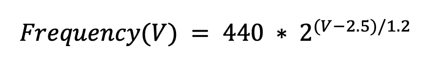
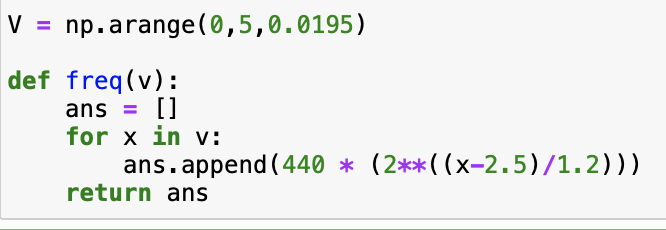

# ECE 445 - Synthesizer - Lab Notebook

ECE 445 - Senior Year Design Project - Affordable Analog Synthesizer - Lab Notebook

# 5th September 2021 - Figured out the main features I am responsible for

**Main Features**

- Take multiple keys from keyboard
- Read keycodes from a file and play that

**Basically need to use microcontroller to recognize certain keycode being pressed and produce a different voltage based on the incoming keycode.**

How can we do that? 

ATMega328u has a voltage output - we will be using Analog Write to use PWM to create effectively lower voltage outputs. 

Need to make PCB Design

My role basically now involves waiting for parts and then assisting with the code to make the Atmega read keycode inputs and then produce different voltage outputs for it. 

# 8th September 2021 

Finalized the subsystems! Decided to have 4. 

- MIDI subsystem - take in inputs and send out voltage out to synthesizer subsystem
- Synthesizer subsystem - taken in voltage input and produces different sounds based on voltage
- Output Module - Speakers that play sound
- Power subsystem - to power the rest 

# 13th September 2021 - MIDI Module Updates

After getting our design approved we decided to add another feature where the synthesizer can also play back files from an SD card where the files hold a series of keys pressed with their durations. Basically we are trying to read the same data that would be sent in by the MIDI keyboard instead. 

Need to figure out how to do this. 

# 20th September 2021 - verification and data flow plan

I need to figure out how to verify my part of the project. 

1) Ability to produce the required voltage outputs. We will use an oscilloscope/voltmeter to measure the voltages our code is producing to verify this. We will have to make code changes that we do not currently know about in order to produce more accurate voltages if our current plan fails.

2) Ability to receive MIDI input and set the variables that determine the voltage produced. To verify this, we will print the variables we are trying to set to the console while pressing keys on the keyboard/letting the microcontroller read from sd card. If we fail, we will have to make software changes to better interpret the MIDI signals which are inputs for our program.

**Proposed data flow**

# 25th September 2021 - Major updates from PCB review

At the PCB review, while we were talking to a lot of TA's about our plan of action, we learned that the Atmega328P does not have a USB interface and it would be impossible to connect a USB keyboard to it. This would require us to use a keyboard with a MIDI output and also program the microcontroller to receive MIDI input. 

# 29th September 2021 

I realized that it would be extremely difficult to use the atmega to receive midi input as well as read sd card data and was looking into other possible ways to get across this. 

I highly preferrred using the Teensy36 Development board as it has all the features I needed to implement my part of the project. 

# 2nd October 2021 - Recognizing what we can do 

Mainly focused on tolerance analysis for the voltage out. 

Atmega has 980 Hz Duty cycle. So using PWM we can create only certain specific voltage outputs. 

**2.5 𝑉 𝑝𝑟𝑜𝑑𝑢𝑐𝑒𝑠 440𝐻𝑧 𝑎𝑛𝑑 𝑒𝑣𝑒𝑟𝑦 𝑖𝑛𝑐𝑟𝑒𝑎𝑠𝑒 𝑜𝑟 𝑑𝑒𝑐𝑟𝑒𝑎𝑠𝑒 𝑏𝑦 1.2𝑉 𝑤𝑖𝑙𝑙 𝑑𝑜𝑢𝑏𝑙𝑒 𝑜𝑟 h𝑎𝑙𝑓 𝑡h𝑒 𝑓𝑟𝑒𝑞𝑢𝑒𝑛𝑐𝑦**

Here is a graph that shows the frequencies we can produce because of limits faced because of the 980Hz duty cycle. 

The frequencies we can produce with these limited voltage outputs may not be exactly the same as a certain musical notes frequency we are aiming to produce. 

Code to find frequencies we can produce based on the voltage values we can produce-

Below code will return the voltage values we can produce in order to produce frequencies closest to a given a list of target frequencies

# 5th October 2021 - Figuring out error

We figured that for our tolerance analysis we will take into account the error rate based on how close the frequencies we can produce are to the target frequencies. 

Error = absolute_val (target frequency - frequency we can produce) / target frequency 

This is how we calculate our Error!!!

Few examples - 

# 15th October 2021 - Parts list Discussion

Worked on making parts list with teammates.

Figured that we need Knobs, switches, Atmega328p, speakers, DAC (to output analog voltage that goes to the synthesizer), Optoisolator (to help with receiving midi input) and a lot of other generic parts needed for the synthesizer subsystem. 

# 22nd October 2021

We realized that our PCB is way larger than the permitted dimensions and we hence figured out that we should split the PCB into 3 different PCB's. 

# 5th November 2021

Still going through issues with PCB. unable to figure out what and why. Need to work on figuring out how to produce these different voltages and how to design the software such that the voltage producing code requires minimum variables to determine what output to produce.

# 14th November 2021 - Code to produce different voltages

Decided to make a switch and produce different voltages for different inputs. Basically analog write different values that produce different voltages based on keycode input.

Pseudo Code -

Trying to use MIDI package to read midi input as well

# 19th November 2021 - mock demo updates

Thankfully, a few things on our PCB were working. We concluded that our VCO does not work. At least we were able to produce a triangular wave as seen below. 

# 28th November 2021 - PLAN B

Figured we need at least something working for the demo. Decided to use Rasberry pi to simulate the synthesizer subsystem using software. Also used a standard computer keyboard with USB input to simply accept keycodes on the resberry pie. 

We just placed the rasberry pie inside our box. connected the keyboard through USB and a speaker from outside through an aux cable as the rasberry pie has an aux port. Looks like this - 

# 29th November 2021 - 

Used standard sd card reading libraries to recieve sd card input. **Proposed format for one note on file on sd card -  8e5 where the number 8 describes the length of the note , the alphabet declares what note to play and the last number determines what octave the note should be in.** Wrote different files with a series of key notes. Used the number pad on the top row of the keyboard to switch between tracks. 

# 30th November - Trying to fix PCB

Decided to try and see what is wrong with the PCB so we can at least show some parts of the synthesizer subsytem working. We-  realised that a lot of the opamps had messed up connections and hard wired one of the missing connections between R44 and U14 hoping to get something to work. 

Used a potentiostat, power supply as well as a breadboard to simulate a VCO to see if the knobs could do anything to the waves we were able to produce.

Below picture shows this set up and the point we were probing on the oscilloscope. Thankfully, we saw that we were able to control the amplitude and frequency of this wave and were able to demo it!

# 3rd December 2021 - Mock presentation advice

After the mock presentation, we got a bunch of advice. Here is what we need to work on for the final presentation. 

- Change theme of presentation to grainger theme.
- Change Contrast of all simulation graphs and make their axes visible.
- Not be monotnous with our tone
- Do not fidget. Stand Straight. 
- Reduce wordings
- Introduce ourselves in the beginning

# 5th December

**The final plan - I have to introduce the project, state our goals and also describe the high level organization of the subsystems. Michael then goes into detail with all the parts we have. Breanne takes over in the end and talks about what we could achieve where we went wrong, conclusions and future plans**

